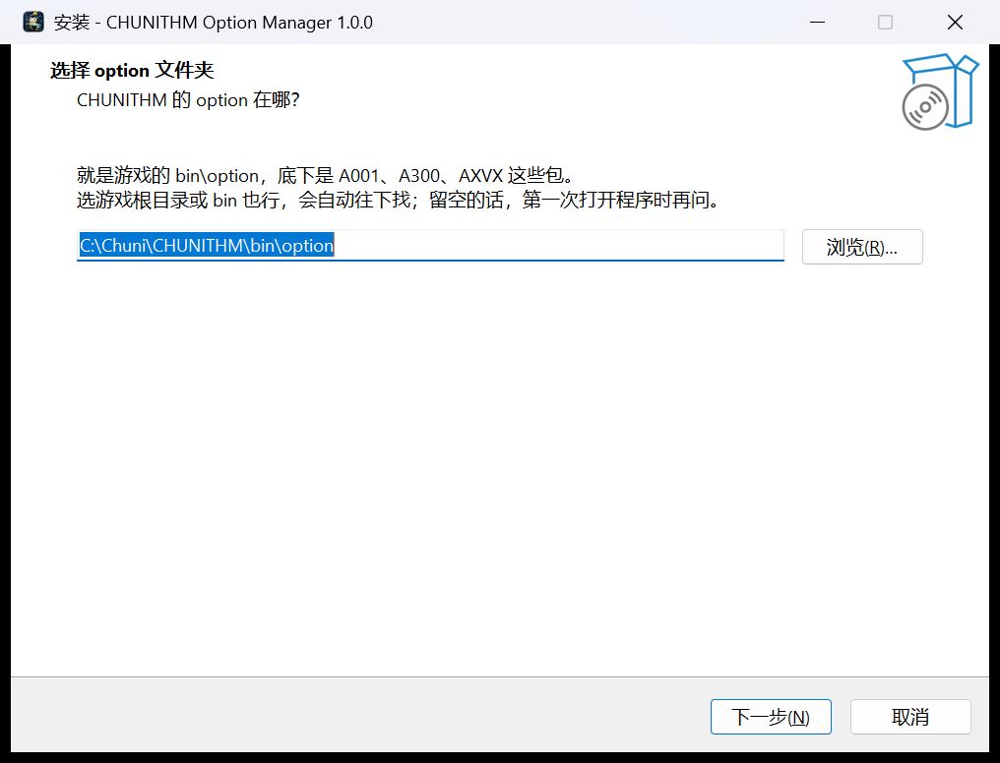

<div align="center">


# CHUNITHM Option Manager

可视化查看与管理 CHUNITHM `option` 文件夹里的歌曲、谱面与角色。


</div>

---

## 安装

到 [Releases](https://github.com/ErikaAlk/ChuniOptionManager/releases) 下载
`ChuniOptionManager-x.y.z-安装程序.exe`，双击装上。

- 装到 `%LOCALAPPDATA%\Programs\ChuniOptionManager`，**不弹 UAC，不需要管理员**。
- 安装过程中有一页让你**选 option 文件夹**：就是 CHUNITHM 的 `bin\option`，
  底下是 `A001`、`A300`、`AXVX` 这些包。选游戏根目录或 `bin` 也行，会自动往下找。
  常见路径能自动填好；这一页也可以留空，第一次打开时再问。
- 目标机器**不需要装 Python**，运行时都在包里。

程序本身和游戏目录再无位置关系，装完之后从开始菜单打开就行。

<div align="center"></div>

## 功能

### 歌曲 / 谱面

- 自动扫描 `A001`、`A300`、`AXVX`、`AZUR` 等 option 包，歌曲按游戏内卡面样式展示，
  曲绘（`.dds`）直接解码显示。
- 按标题 / ID / 曲师 / 分类搜索，按 BASIC~WORLD'S END 难度或「文件缺失」筛选，
  六种排序。
- 谱面详情逐条切换 `enable`，保存写回 `Music.xml`——**只改 `<enable>` 那几个字节**，
  其余格式一个字节都不动。

### 角色

- 角色卡片解码 DDS 预览，元数据可编辑并写回 `Chara.xml`。
- 基于 `AZUR` 乳蛙模板新增角色，「单图快速生成」一张图裁出
  `big.dds`(1080) / `small.dds`(512) / `thumb.dds`(128)，DXT5 + 完整 mipmap 链。

### 作品库（works）

- 扫描 option 内 `CharaWorks.xml` 列出作品；可新建（选写入哪个包）、改名、删除，
  并维护 `WorksSort.xml` 的顺序。
- **删除作品会连带删除属于它的角色。**

### 排查

- 启用但 `.c2s` 缺失（同一首歌缺多个难度合并成一条）、同 ID 重复但难度不一致、
  角色图索引缺失。
- WORLD'S END 拆成独立条目视为正常，不计入。

## 截图

| 歌曲 | 角色 |
| :---: | :---: |
|  |  |

## 添加角色

角色页右上角「新增角色」：

- **ID**：填「基 ID」+「皮肤 ID」，最终 ID = 基 ID × 10 + 皮肤 ID（皮肤是个位 0–9，
  0 即默认皮肤；如基 `2469` + 皮肤 `0` → `chara24690`，模板 `chara114514` = 基 `11451`
  + 皮肤 `4`）。基 ID 留空＝自动分配下一个空闲号（≥114514）；已占用的号（含 `_deleted`
  里的）会被拦下。
- **贴图**：「单图快速生成三张贴图」里传一张 PNG/JPG，在全身 / 半身 / 大头三格分别
  拖拽、滚轮缩放对位。底下垫着模板贴图，上面那张的透明度可调，用来对位。
  不生成就不写任何 DDS——不会套用模板的乳蛙贴图。
- **作品**：从作品库下拉选，写入新角色的 `works`。「新建…」可选目标包创建作品，
  「管理库…」能改名和删除。
- 写入 `Chara.xml` + `DDSImage.xml`，`priority` 设为 `999`。

## 难度配色

| 难度 | 颜色 |
| --- | --- |
| BASIC | `#00A985` |
| ADVANCED | `#F97700` |
| EXPERT | `#E02929` |
| MASTER | `#B700FF` |
| ULTIMA | 黑 |
| WORLD'S END | 彩虹渐变 |

## 数据安全

- **备份**：每个文件第一次被保存时复制一份 `<file>.bak`，只复制一次——
  这样备份里留的永远是最初那份，而不是上一次的错误。
- **软删除**：删除歌曲 / 角色 / 作品时，目录移进 `option\_deleted\<时间戳>_<类型>_…\`，
  不会真正删除，重新扫描时排除。
- **写入范围**：只动你指定的那个 option 文件夹。移动目录前会检查目标在 option 根目录
  之内，根目录本身和 `_deleted` 一律拒绝。
- 设置和崩溃日志在 `%APPDATA%\ChuniOptionManager\`，卸载不会带走。

## 从源码跑

需要 **Python 3.11**（科学计算和 Qt 的轮子都在这一版上）。

```powershell
py -3.11 -m venv .venv
.venv\Scripts\pip install -r requirements.txt
.venv\Scripts\python main.py
```

指定 option 目录：`--option-root "D:\CHUNITHM\bin\option"`，或设环境变量
`CHUNI_OPTION_ROOT`。都不给就按配置和自动探测来，探不到会弹选目录向导。

跑测试（不需要显示器，也不会碰真实的游戏目录）：

```powershell
.venv\Scripts\python -m pytest tests -q
```

## 打包

```powershell
.venv\Scripts\python packaging\build.py
```

四步：跑测试 → PyInstaller 打 exe → **启动冒烟** → Inno Setup 出安装包。
安装包在 `dist_installer\`。需要 [Inno Setup 6](https://jrsoftware.org/isdl.php)
（`winget install --id JRSoftware.InnoSetup`）。

`--skip-tests` / `--no-installer` / `--skip-smoke` 可以跳过对应步骤。

## 结构

```
main.py            入口：先确定 option 在哪，再开主窗口
core/              文件与 XML 处理，不认识 Qt
  paths.py           找 option 根目录、记住它
  xmlio.py           两套写法：字节级改写 / 重排缩进
  repository.py      扫描、排查、保存、软删除、新增角色、作品库
  difficulty.py      难度的唯一真源（归一、排序、配色）
  models.py          数据模型
  dds.py             PNG/JPG → DXT5 + mipmap（手写编码器）
  ddspreview.py      DDS → PNG 预览缓存
ui/                界面（PySide6）
  theme.py           配色 / 字号 / 自绘控件，照 Apple HIG
  main_window.py     三页 + 右侧检查器
  cards.py           歌曲行、角色格、排查行的自绘
  editors.py         两个检查器面板
  add_character.py   新增角色
  crop_window.py     单图快速生成
  works_dialogs.py   作品库
  first_run.py       选 option 文件夹
packaging/         app.spec / installer.iss / build.py / app.ico
tests/             98 条，pytest
```

## 许可

[MIT](LICENSE) © Erika

> 非官方粉丝向工具，仅供个人学习与本地管理使用。
