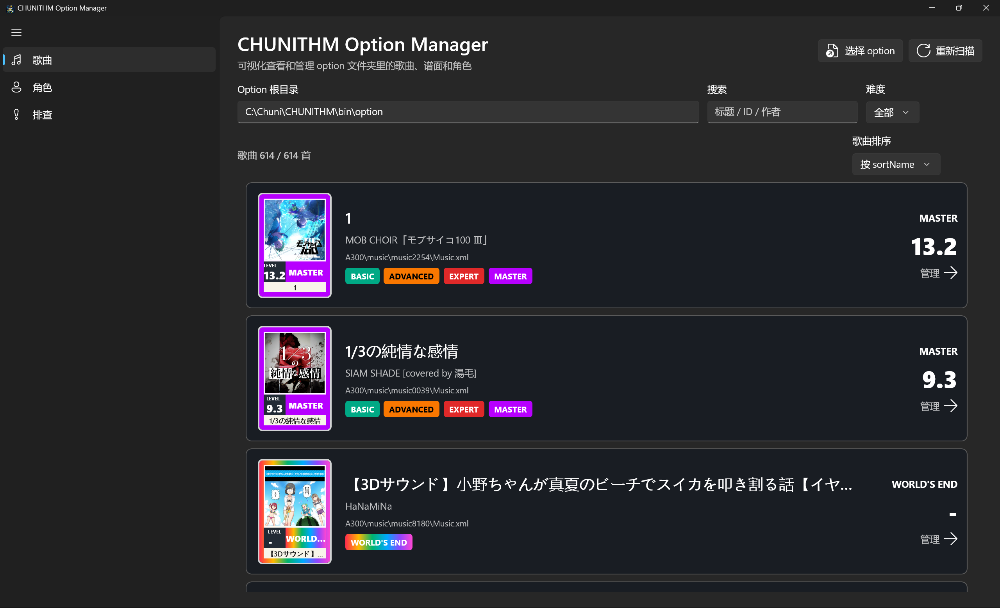
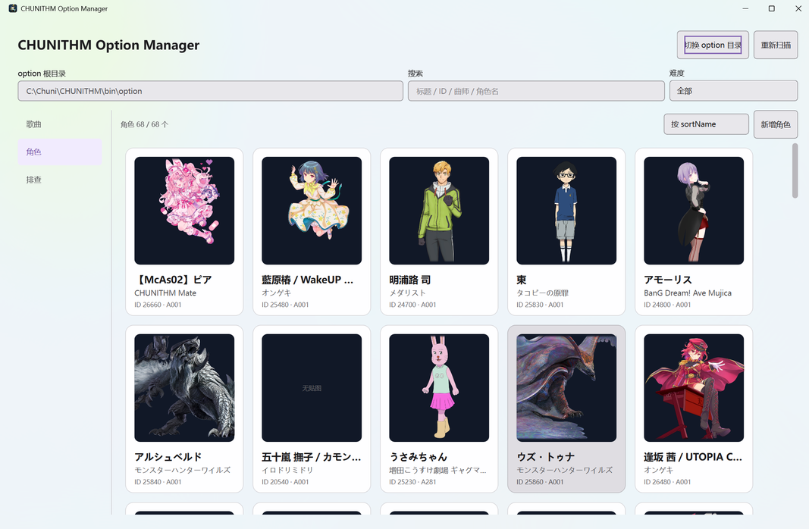

<div align="center">


# CHUNITHM Option Manager

可视化查看与管理 CHUNITHM `option` 文件夹里的**歌曲、谱面与角色**的桌面工具。


</div>

---

## ✨ 功能

**歌曲 / 谱面**
- 自动扫描 `A001`、`A300`、`AXVX`、`AZUR` 等 option 包，歌曲按游戏内卡面样式展示。
- 按标题 / ID / 作者 / 分类搜索，按 BASIC~WORLD'S END 难度或「文件缺失」筛选。
- 谱面详情可切换 `enable`，保存写回 `Music.xml`。

**角色**
- 角色卡片解码 DDS 预览，可编辑元数据写回 `Chara.xml`。
- 基于 `AZUR` 乳蛙模板新增角色，「单图快速生成」一张图裁出 `big/small/thumb.dds`。

**作品库（works）**
- 扫描 option 内 `CharaWorks.xml` 列出作品；可新建（可选写入包）、编辑、删除。
- **删除作品会连带删除属于它的角色。**

**排查**
- 启用但 `.c2s` 缺失、同 ID 重复但难度不一致、角色图索引缺失。
- 同一首歌缺失多个难度合并为一条；WORLD'S END 拆分视为正常，不计入。

**通用**
- 统一深色标题栏与窗口图标；首次保存生成 `.bak`；删除为软删除（移入 `_deleted`）。

## 📸 截图

| 歌曲 | 角色 |
| :---: | :---: |
|  |  |

## 🧩 添加角色

点击角色页右上角「添加角色」：

- **贴图**：用「单图快速生成三张贴图」窗口上传一张 PNG/JPG，在全身 / 半身 / 大头三格分别拖拽、滚轮缩放对位，确认后输出 DXT5 + mipmap 的 `big.dds`(1080) / `small.dds`(512) / `thumb.dds`(128)。不生成则不写任何 DDS。
- **作品**：从作品库下拉选择，写入新角色的 `works`；「新建…」可选目标包创建作品，「管理库…」可编辑 / 删除（窗口居中弹出）。
- 创建时自动分配 `chara{id}`（≥114514）、写 `Chara.xml` + `DDSImage.xml`，并把 `priority` 设为 `999`。

## 🎨 难度配色

| 难度 | 颜色 |
| --- | --- |
| BASIC | `rgb(0, 169, 133)` |
| ADVANCED | `rgb(249, 119, 0)` |
| EXPERT | `rgb(224, 41, 41)` |
| MASTER | `rgb(183, 0, 255)` |
| ULTIMA / ULTRA | black |
| WORLD'S END | 彩虹渐变 |

## 🛡️ 数据安全

- **备份**：每个文件首次保存时复制一份 `<file>.bak`。
- **软删除**：删除歌曲 / 角色 / 作品时，目录移入 `option\_deleted\<时间戳>_<类型>_…\`，不会真正删除，重新扫描时排除。

## 🚀 构建与运行

需要 .NET SDK 与 **Windows App SDK / WinUI 3** 工作负载。

```powershell
dotnet build -c Release -p:Platform=x64
```

- 本项目为 `WindowsAppSDKSelfContained`，**必须带 `-p:Platform=x64`** 提供架构，否则报 `requires a supported Windows architecture`。
- 输出到 `bin\x64\Release\net8.0-windows10.0.19041.0\`（与 Visual Studio 一致）。也可在 Visual Studio 直接 F5。
- 仅 x64；目标框架 `net8.0-windows10.0.19041.0`。

## 🗂️ 技术栈与结构

WinUI 3 / Windows App SDK · .NET 8 · 代码后置（无 MVVM 框架）· `System.Drawing.Common` 手写 DDS（DXT1/3/5）编解码。

```
Models/      数据模型（MusicItem / CharacterItem / WorksItem / …）
Services/    文件与 XML 处理（OptionRepository、DDS 编解码、根目录定位）
MainWindow.xaml(.cs)   全部 UI：三页（歌曲 / 角色 / 排查）+ 两个编辑浮层
Assets/AppIcon.{png,ico}  应用图标（PNG 源图 + 生成的多尺寸 ICO）
docs/                  README 截图
```

## 📄 许可

[MIT](LICENSE) © Erika

> 非官方粉丝向工具，仅供个人学习与本地管理使用。
